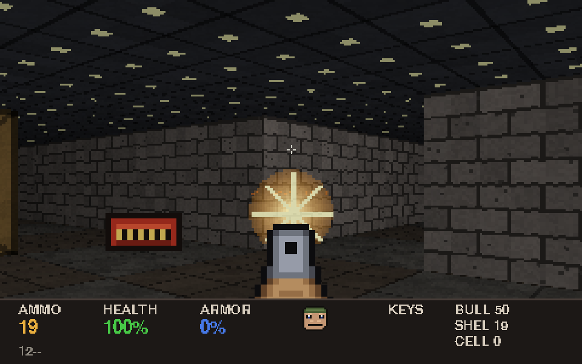
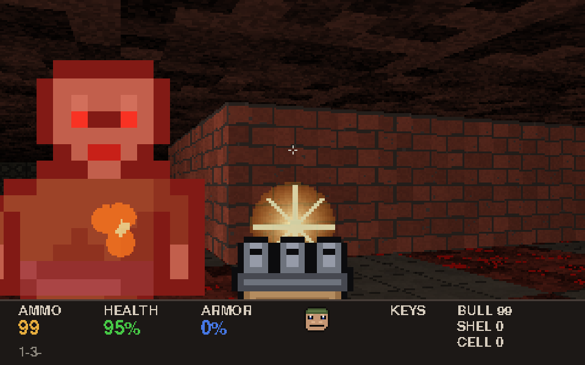

# HELLBREAK

A retro demon-blasting first-person shooter written in pure Python —
built in the spirit of the classic 90s FPS games (Doom II and friends),
with a custom raycasting engine and **100% original, procedurally
generated assets**: every wall texture, sprite, sound effect and the
music loop are synthesized in code at startup. No binary asset files,
no copyrighted material.




## Running

Requires Python 3.9+ with `pygame` and `numpy`:

```bash
pip install -r requirements.txt
python main.py
```

## Controls

| Input | Action |
|---|---|
| `W A S D` | Move / strafe |
| Mouse (click window to grab) | Turn |
| `←` / `→` | Turn (keyboard) |
| Left mouse / `Ctrl` | Fire |
| `Shift` | Run |
| `E` / `Space` | Open doors, press switches |
| `1`–`4` | Select weapon |
| `Tab` | Toggle minimap |
| `Esc` | Pause / release mouse |

## The game

You are the last marine holding the line when the Spire breached.
Fight through two hand-built levels:

1. **Techbase Perimeter** — a UAC-flavoured installation of tech walls,
   crates and locked security doors.
2. **Gates of the Spire** — bone halls and glowing hellrock.

Features, in the classic mould:

- **Weapons**: pistol, shotgun (7-pellet spread), minigun, and a
  plasma rifle with projectile bolts — with distinct ammo pools
  (bullets / shells / cells) and weapon pickups.
- **Monsters**: possessed *grunts* (hitscan riflemen), horned *fiends*
  (fireball throwers) and hulking *ravagers* (melee bruisers), each with
  idle/chase/attack/pain/death states, line-of-sight alerting,
  BFS pathfinding around walls, and death animations.
- **Level furniture**: sliding doors (some auto-close), blue/red
  keycard doors, exploding barrels with chain reactions and splash
  damage, and an end-of-level exit switch.
- **Doom-style status bar** with ammo/health/armor readouts, keycard
  slots, and a marine face that degrades as you take damage.
- **Intermission screens** with kill/item/time tallies, death & victory
  screens, pause menu, and a toggleable minimap.
- **Synthesized audio** — gunshots, growls, explosions, pickups and a
  chugging E-minor riff loop, all generated with numpy at load time.

## How it works

| File | What it does |
|---|---|
| `main.py` | Game states (title/play/pause/dead/intermission/victory) and the main loop |
| `raycaster.py` | DDA raycaster: textured walls with fog + side shading, numpy-vectorised textured floors & ceilings, z-buffered billboard sprites, Wolfenstein-style recessed sliding doors |
| `world.py` | Grid world: door state machines, circle-vs-grid collision with wall sliding, DDA line-of-sight, BFS pathfinding |
| `entities.py` | Enemy AI state machines, pickups, projectiles, barrels, effects |
| `player.py` | Movement, four weapons (hitscan + projectile), damage/armor, use-key interactions |
| `texgen.py` | Procedural 64×64 wall/floor/ceiling textures (numpy) |
| `pixelart.py` | All sprites, authored as ASCII pixel-art maps; pain/death frames derived automatically |
| `sounds.py` | All SFX and music, synthesized from oscillators + noise |
| `mapdata.py` | The two levels as annotated ASCII grids |
| `hud.py` | Status bar, weapon view, crosshair, minimap, messages |

The renderer draws at an internal 320×200 and upscales 3× for the
chunky retro look. On a modern machine it runs comfortably above the
60 FPS cap.

## A note on assets

This is an original homage, not a copy: all names, art, maps, sounds
and music are new works generated by the code in this folder. The only
resemblance to the 1994 classics is mechanical and atmospheric.
